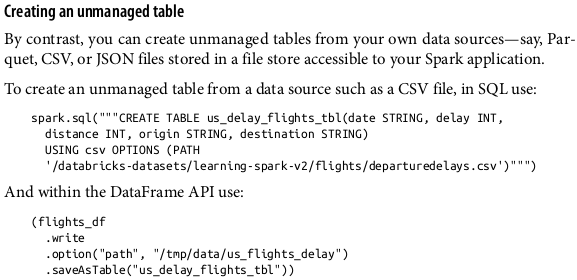

# spark_interview_preparation
Throughout my career, I have used spark for a lot of data analysis activities, but when I have to do a spark interview sometimes I don't find the best words for explaining concepts sometimes I shock when they ask me to do an exercise live, so I created this repo to record my journey, my preparation for future interviews.

If you want access to the sources, such as books, links or pieces of code, feel free to reach out.

## Theorical Questions Section

### Theorical Question 1

In a Spark application what is the driver program and does it get access to resources such as the the Spark executors ?

<b>Answer</b>

Spark application consists of a driver program that is responsible for orchestrating parallel operations on the Spark cluster. The driver accesses the distributed components in the cluster—the Spark executors and cluster manager—through a SparkSession .

<b>Source</b>

learningSpark2.0 - pag 2

### Theorical Question 2

Why is spark faster than hadoop mapReduce ?

<b>Answer</b>

Spark provides in-memory storage for intermediate computations, making it much
faster than Hadoop MapReduce.

<b>Source</b>

learningSpark2.0 - pag 4

### Theorical Question 3

Do you understand what are the spark stages ?

<b>Answer</b>

As part of the DAG nodes, stages are created based on what operations can be per‐
formed serially or in parallel . Not all Spark operations can happen in a
single stage, so they may be divided into multiple stages.

<b>Source</b>

learningSpark2.0 - pag 28

### Theorical Question 4

Do you understand the difference between spark operation actions and spark operation transformation ?

<b>Answer</b>

Transformations, as the name suggests, transform a Spark DataFrame
into a new DataFrame without altering the original data, giving it the property of
immutability. Put another way, an operation such as select() or filter() will not
change the original DataFrame; instead, it will return the transformed results of the
operation as a new DataFrame.

All transformations are evaluated lazily. That is, their results are not computed immediately, but they are recorded or remembered as a lineage. A recorded lineage allows Spark, at a later time in its execution plan, to rearrange certain transformations, coalesce them, or optimize transformations into stages for more efficient execution. Lazy evaluation is Spark’s strategy for delaying execution until an action is invoked or data is “touched” (read from or written to disk).

An action triggers the lazy evaluation of all the recorded transformations.

<b>Source</b>

learningSpark2.0 - pag 28

### Theorical Question 5

Do you understand the difference between wide and narrow transformations ?

<b>Answer</b>

Transformations can be classified as having either narrow dependencies or wide
dependencies. Any transformation where a single output partition can be computed
from a single input partition is a narrow transformation. For example, in the previous

code snippet, filter() and contains() represent narrow transformations because
they can operate on a single partition and produce the resulting output partition
without any exchange of data.

However, groupBy() or orderBy() instruct Spark to perform wide transformations,
where data from other partitions is read in, combined, and written to disk. Since each partition will have its own count of the word that contains the “Spark” word in its row of data, a count ( groupBy() ) will force a shuffle of data from each of the executor’s partitions across the cluster. In this transformation, orderBy() requires output fromother partitions to compute the final aggregation.

<b>Source</b>

learningSpark2.0 - pag 30

### Theorical Question 6

Why would you use RDD instead of dataframes ?

<b>Answer</b>

There are two possible reasons:

• Are using a third-party package that’s written using RDDs

• Want to precisely instruct Spark how to do a query

<b>Source</b>

learningSpark2.0 - pag 75

### Theorical Question 7

Where does spark store metadata like the schema, description, table name, data‐
base name, column names, partitions, physical location where the actual data resides,
etc.

<b>Answer</b>

Tables hold data. Associated with each table in Spark is its relevant metadata, which is information about the table and its data: the schema, description, table name, database name, column names, partitions, physical location where the actual data resides, etc. 

All of this is stored in a central metastore.

Instead of having a separate metastore for Spark tables, Spark by default uses the
Apache Hive metastore, located at /user/hive/warehouse, to persist all the metadata
about your tables. However, you may change the default location by setting the Spark
config variable spark.sql.warehouse.dir to another location, which can be set to a
local or external distributed storage.

<b>Source</b>

learningSpark2.0 - pag 89

### Theorical Question 8

Do you know the difference between managed and unmanaged tables

<b>Answer</b>

Spark allows you to create two types of tables: managed and unmanaged. For a managed table, Spark manages both the metadata and the data in the file store. This could be a local filesystem, HDFS, or an object store such as Amazon S3 or Azure Blob. 

For an unmanaged table, Spark only manages the metadata, while you manage the data
yourself in an external data source such as Cassandra.

With a managed table, because Spark manages everything, a SQL command such as
DROP TABLE table_name deletes both the metadata and the data. With an unmanaged
table, the same command will delete only the metadata, not the actual data.

<b>Source</b>

learningSpark2.0 - pag 90

### Theorical Question 9

Do you know what views are ?

<b>Answer</b>

In addition to creating tables, Spark can create views on top of existing tables. Views can be global (visible across all SparkSession s on a given cluster) or session-scoped (visible only to a single SparkSession ), and they are temporary: they disappear after your Spark application terminates.

Creating views has a similar syntax to creating tables within a database. Once you create a view, you can query it as you would a table. The difference between a view and a table is that views don’t actually hold the data; tables persist after your Spark application terminates, but views disappear.

<b>Source</b>

learningSpark2.0 - pag 92

### Theorical Question 10

Do you know the difference between global and temporary views ?

<b>Answer</b>

The difference between temporary and global temporary views being subtle, it can be a
source of mild confusion among developers new to Spark. A temporary view is tied
to a single SparkSession within a Spark application. In contrast, a global temporary
view is visible across multiple SparkSession s within a Spark application. 

Yes, you can create multiple SparkSession s within a single Spark application—this can be handy, for example, in cases where you want to access (and combine) data from two different SparkSession s that don’t share the same Hive metastore configurations.

<b>Source</b>

learningSpark2.0 - pag 92

### Theorical Question 11

Do you know why you don't specify an schema when you are working with a parquet file ?

<b>Answer</b>

Unless you are reading from a streaming data source there’s no need to supply the
schema, because Parquet saves it as part of its metadata.

<b>Source</b>

learningSpark2.0 - pag 98

### Theorical Question 12

Do you think serializing and deserialing data would make Dataset or Dataframe give a greater performance ?

<b>Answer</b>

In “DataFrames Versus Datasets” on page 74 in Chapter 3, we outlined some of the
benefits of using Datasets—but these benefits come at a cost. As noted in the
preceding section, when Datasets are passed to higher-order functions such as fil
ter() , map() , or flatMap() that take lambdas and functional arguments, there is a
cost associated with deserializing from Spark’s internal Tungsten format into the JVM
object.

Compared to other serializers used before encoders were introduced in Spark, this
cost is minor and tolerable. However, over larger data sets and many queries, this cost accrues and can affect performance.

<b>Source</b>

learningSpark2.0 - pag 170

### Theorical Question 13

How would you change the properties/config files of spark ?

<b>Answer</b>

There are three ways you can get and set Spark properties. The first is through a set of configuration files. In your deployment’s $SPARK_HOME directory (where you installed
Spark), there are a number of config files: conf/spark-defaults.conf.template, conf/
log4j.properties.template, and conf/spark-env.sh.template. Changing the default values in these files and saving them without the .template suffix instructs Spark to use these new values.

<b>Source</b>

learningSpark2.0 - pag 173

### Theorical Question 14

How would you avoid job failures due to resource starvation or gradual performance degradation ?

<b>Answer</b>

When you specify compute resources as command-line arguments to spark-submit ,
as we did earlier, you cap the limit. This means that if more resources are needed later as tasks queue up in the driver due to a larger than anticipated workload, Spark cannot accommodate or allocate extra resources.
If instead you use Spark’s dynamic resource allocation configuration, the Spark driver can request more or fewer compute resources as the demand of large workloads flows and ebbs. 
In scenarios where your workloads are dynamic—that is, they vary in their
demand for compute capacity—using dynamic allocation helps to accommodate sud‐
den peaks.
One use case where this can be helpful is streaming, where the data flow volume may
be uneven. Another is on-demand data analytics, where you might have a high vol‐
ume of SQL queries during peak hours. Enabling dynamic resource allocation allows
Spark to achieve better utilization of resources, freeing executors when not in use and acquiring new ones when needed.

<b>Source</b>

learningSpark2.0 - pag 177

### Theorical Question 15

Do you understand the difference between cache() and persist() ?

<b>Answer</b>

<b>Source</b>

learningSpark2.0 - pag 177

### Theorical Question 16

When should you cache and not to cache data ?

<b>Answer</b>

<b>Source</b>

learningSpark2.0 - pag 187

### Theorical Question 17

When do you use broadcast hash join ?

<b>Answer</b>

<b>Source</b>

learningSpark2.0 - pag 188

## Practical Questions Section

### Practical Question 1

Could you explain line by line what the next piece of code is doing ?

<b>Answer</b>

<b>Source</b>

learningSpark2.0 - pag 36

### Practical Question 2

How would you execute the program ?

<b>Answer</b>

$SPARK_HOME/bin/spark-submit mnmcount.py data/mnm_dataset.csv

<b>Source</b>

learningSpark2.0 - pag 37

### Practical Question 3

Do you understand what this line is doing ?

blogsDF.select(expr("Hits * 2")).show(2)

<b>Answer</b>

It is creating a columns where all of the values of the column "Hits" are multiplied by 2, and it is only showing the first 2 rows

<b>Source</b>

learningSpark2.0 - pag 55

### Practical Question 4

Do you know how to create a managed and an unmanaged spark table ?

<b>Answer</b>

<b>Source</b>

learningSpark2.0 - pag 91

### Practical Question 5

How would you view metadata in spark ?

<b>Answer</b>

<b>Source</b>

learningSpark2.0 - pag 93

